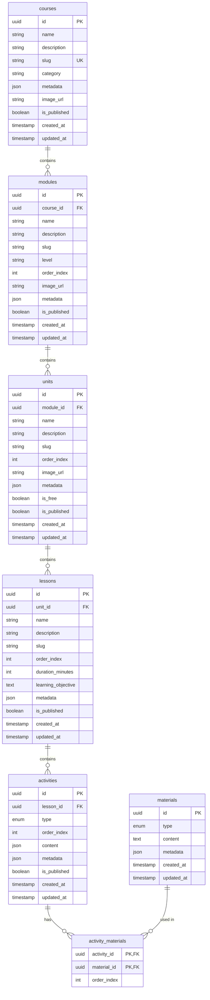
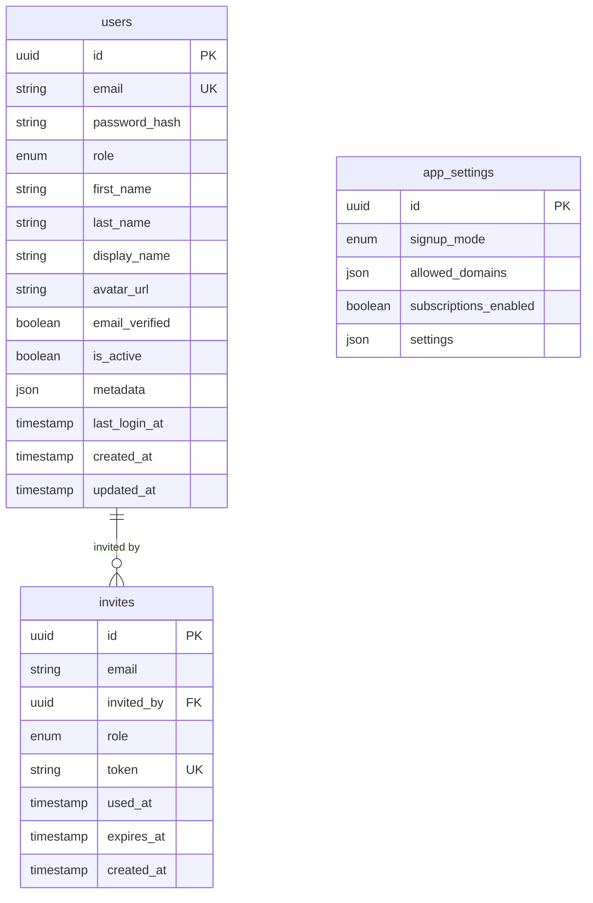
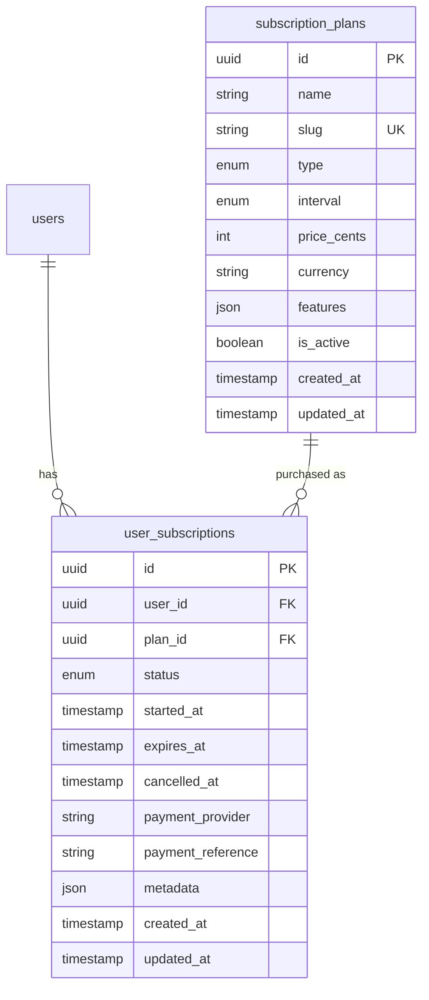
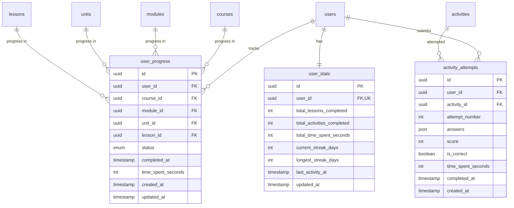
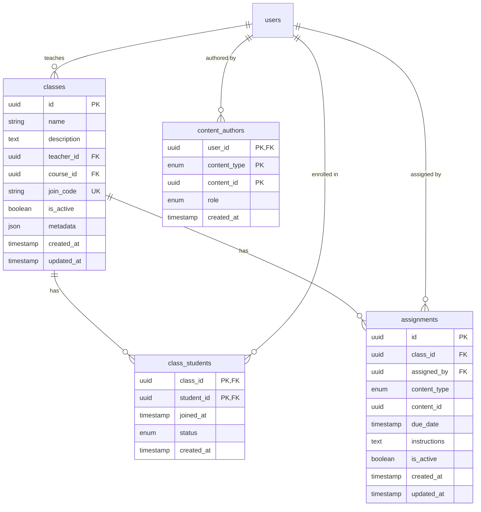
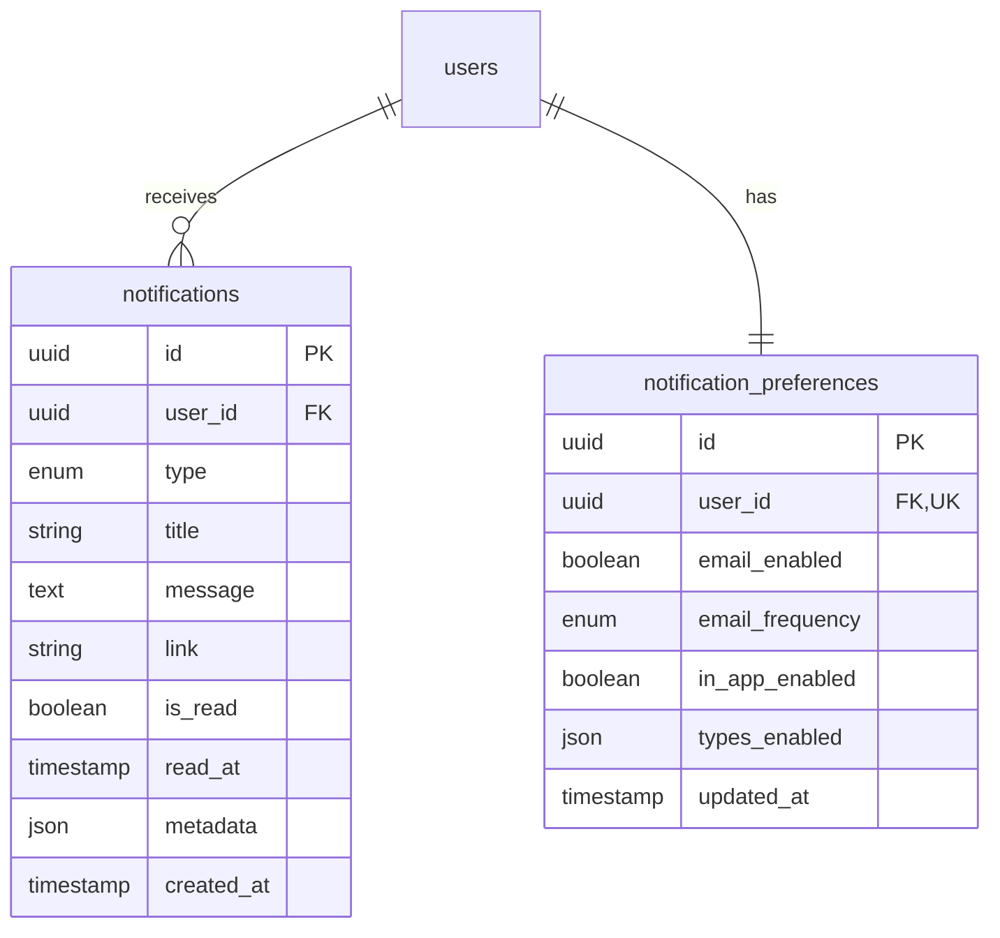
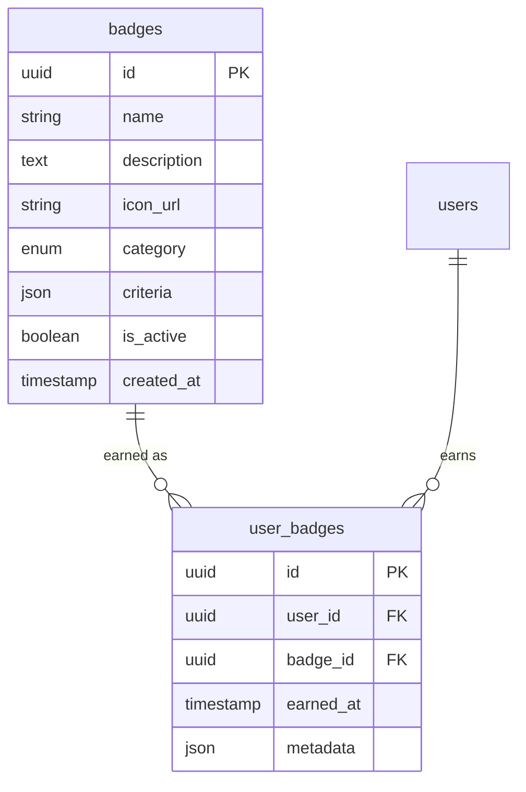
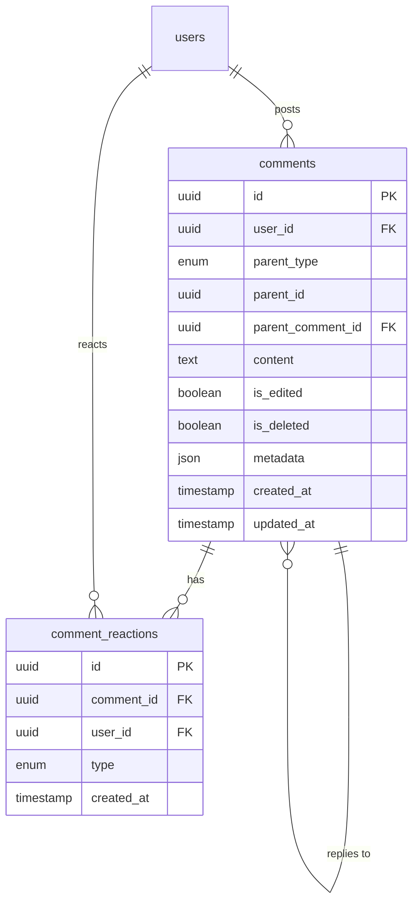
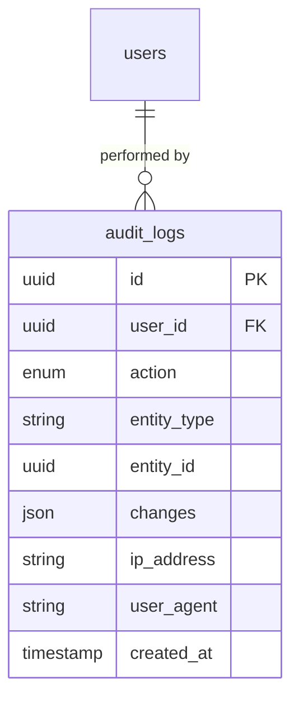
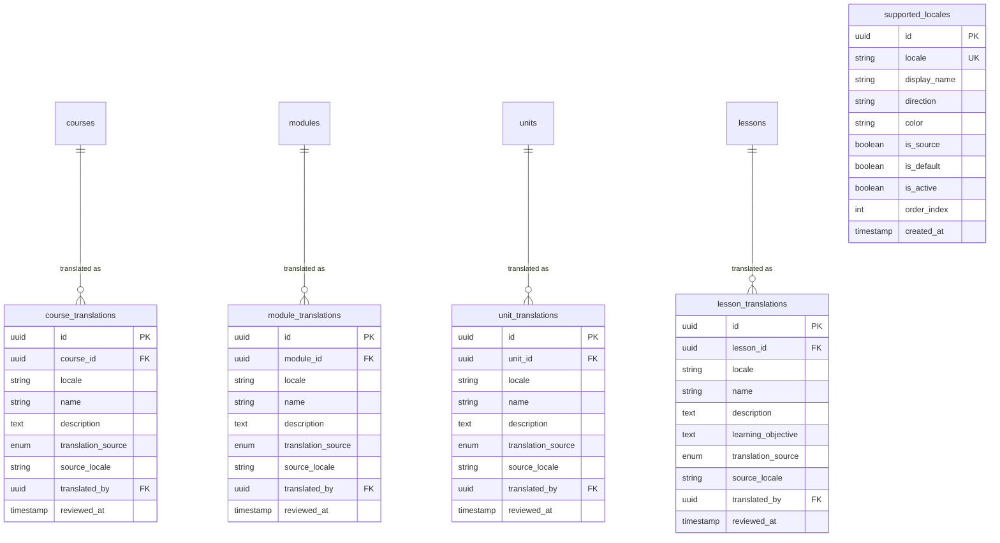

# Data Model Design - HinbunaKurdi LMS

**Status:** Approved
**Date:** 2026-02-01
**Author:** Nuri Armanç Engin + Claude

---

## Overview

Generic LMS data model designed to support:
- **HinbunaKurdi** - Kurdish language learning platform (B2C with subscriptions)
- **Boilerplate sales** - Reusable for any LMS domain (languages, safety training, math, etc.)

### Key Design Principles

- **Generic schema** - No domain-specific fields; use `metadata` JSON for customization
- **Optional features** - Subscriptions, assignments, badges can be disabled per deployment
- **Flexible access control** - Unit-level gating, configurable signup modes
- **UUID primary keys** - Distributed-friendly, non-guessable
- **AI-first architecture** - Core AI (error tracking, skill profiling, engagement) in every deployment; Premium AI (conversation AI, content generation) as optional module

---

## Content Structure (7 tables)

### courses

| Column | Type | Notes |
|--------|------|-------|
| id | UUID | PK |
| name | string | |
| description | text | |
| slug | string | unique |
| category | string | nullable - "language", "safety", "math" |
| metadata | JSON | domain-specific config |
| image_url | string | nullable |
| is_published | boolean | |
| created_at | timestamp | |
| updated_at | timestamp | |

### modules

| Column | Type | Notes |
|--------|------|-------|
| id | UUID | PK |
| course_id | UUID | FK → courses |
| name | string | |
| description | text | |
| slug | string | |
| level | string | "Beginner", "A1", "Week 1", etc. |
| order_index | int | |
| image_url | string | nullable |
| metadata | JSON | |
| is_published | boolean | |
| created_at | timestamp | |
| updated_at | timestamp | |

### units

| Column | Type | Notes |
|--------|------|-------|
| id | UUID | PK |
| module_id | UUID | FK → modules |
| name | string | |
| description | text | |
| slug | string | |
| order_index | int | |
| image_url | string | nullable |
| metadata | JSON | |
| is_free | boolean | **ACCESS GATE** |
| is_published | boolean | |
| created_at | timestamp | |
| updated_at | timestamp | |

### lessons

| Column | Type | Notes |
|--------|------|-------|
| id | UUID | PK |
| unit_id | UUID | FK → units |
| name | string | |
| description | text | |
| slug | string | |
| order_index | int | |
| duration_minutes | int | nullable - estimated |
| learning_objective | text | nullable |
| metadata | JSON | |
| is_published | boolean | |
| created_at | timestamp | |
| updated_at | timestamp | |

### activities

| Column | Type | Notes |
|--------|------|-------|
| id | UUID | PK |
| lesson_id | UUID | FK → lessons |
| type | enum | mcq, gap_fill, matching, flashcard, word_order, reading, listening |
| order_index | int | |
| content | JSON | question, options, correct_answer, hints — uses `{locale: value}` keys for translations (Pattern D) |
| metadata | JSON | |
| is_published | boolean | |
| created_at | timestamp | |
| updated_at | timestamp | |

> **Multi-language note:** Activities use JSONB with language keys (Pattern D) rather than a separate translation table, because activity content is deeply nested and variable per type. Example: `{"question": {"ku": "Navê te çi ye?", "de": "Wie heißt du?"}, "options": [{"ku": "...", "de": "..."}]}`. See [multi-lang.html](../mockup/multi-lang.html) for architecture overview.

### materials

| Column | Type | Notes |
|--------|------|-------|
| id | UUID | PK |
| type | enum | text, audio, image, video, document |
| content | text | text content OR S3 URL |
| metadata | JSON | translations, alt_text, duration |
| created_at | timestamp | |
| updated_at | timestamp | |

### activity_materials (join table)

| Column | Type | Notes |
|--------|------|-------|
| activity_id | UUID | FK → activities, PK |
| material_id | UUID | FK → materials, PK |
| order_index | int | |

#### ERD



---

## Users & Auth (5 tables)

### users

| Column | Type | Notes |
|--------|------|-------|
| id | UUID | PK |
| email | string | unique |
| password_hash | string | |
| first_name | string | |
| last_name | string | |
| display_name | string | nullable |
| avatar_url | string | nullable |
| language | string(5) | UI language — "de", "en", "ku", "tr", etc. Default "de" |
| ui_locale | string(10) | For i18n (UI labels) — "de", "en", "ku". Default "de" |
| content_locale | string(10) | For lesson translations — "de", "en". Default "de" |
| translations_visible | boolean | Default true. False = immersion mode (no translations shown) |
| email_verified | boolean | |
| is_active | boolean | soft disable |
| metadata | JSON | preferences, profile extras |
| last_login_at | timestamp | nullable |
| created_at | timestamp | |
| updated_at | timestamp | |

> **Note:** `role` removed from users table. Roles are managed via `roles` + `user_roles` tables (see below). The `language` column stores UI preference — not buried in metadata JSON. The `ui_locale` and `content_locale` columns support the two-layer language system (see Multi-Language / Translations section). `translations_visible` allows users to hide translations for immersion mode.

### roles

Defines available roles per deployment. Ships with system defaults, B2B clients can add custom roles via admin panel.

| Column | Type | Notes |
|--------|------|-------|
| id | UUID | PK |
| name | string | "Main Teacher", "Standard Teacher", "Content Reviewer" |
| slug | string | unique, for code references — "main_teacher", "standard_teacher" |
| base_type | enum | student, teacher, admin — keeps 3-tier routing/guards simple |
| permissions | JSON | ["manage_teachers", "edit_content", "view_analytics", ...] |
| is_default | boolean | auto-assigned when user registers with this base_type |
| is_system | boolean | true = shipped default, can't be deleted |
| created_at | timestamp | |
| updated_at | timestamp | |

**System roles shipped with every deployment:**

| slug | base_type | is_default | Purpose |
|------|-----------|------------|---------|
| `student` | student | true | Default student |
| `main_teacher` | teacher | false | Full teacher access — manage other teachers, all content |
| `standard_teacher` | teacher | true | Default teacher — own classes and content only |
| `admin` | admin | true | Full system access |

**B2B examples** (added per deployment via admin panel):

| slug | base_type | Example deployment |
|------|-----------|-------------------|
| `department_head` | teacher | School with departments |
| `content_reviewer` | teacher | Large content team |
| `trainer` | teacher | Corporate training |
| `manager` | admin | Corporate with limited admin |

### user_roles

| Column | Type | Notes |
|--------|------|-------|
| user_id | UUID | FK → users, PK |
| role_id | UUID | FK → roles, PK |
| assigned_by | UUID | FK → users, nullable (null = self-registered) |
| created_at | timestamp | |

> **Design:** A user can have multiple roles (e.g., teacher + admin). App checks `base_type` for routing/UI, `permissions` for granular access.

### invites

| Column | Type | Notes |
|--------|------|-------|
| id | UUID | PK |
| email | string | |
| invited_by | UUID | FK → users |
| role_id | UUID | FK → roles |
| token | string | unique |
| used_at | timestamp | nullable |
| expires_at | timestamp | |
| created_at | timestamp | |

### app_settings

| Column | Type | Notes |
|--------|------|-------|
| id | UUID | PK (single row or key-value) |
| signup_mode | enum | public, invite_only, domain_restricted |
| allowed_domains | JSON | ["@company.com"] |
| subscriptions_enabled | boolean | |
| translations_enabled | boolean | Default true. Can disable for single-language deployments |
| source_locale | string(10) | The language being taught — "ku" for HinbunaKurdi |
| default_locale | string(10) | Fallback locale for new users — "de" for HinbunaKurdi |
| ... | | other app-wide settings |

#### ERD



---

## Subscriptions (2 tables)

### subscription_plans

| Column | Type | Notes |
|--------|------|-------|
| id | UUID | PK |
| name | string | "Monthly", "Yearly", "Lifetime" |
| slug | string | unique |
| type | enum | recurring, one_time |
| interval | enum | month, year, null (for lifetime) |
| price_cents | int | 999 = €9.99 |
| currency | string | EUR, USD |
| features | JSON | for display |
| is_active | boolean | can new users buy? |
| created_at | timestamp | |
| updated_at | timestamp | |

### user_subscriptions

| Column | Type | Notes |
|--------|------|-------|
| id | UUID | PK |
| user_id | UUID | FK → users |
| plan_id | UUID | FK → subscription_plans |
| status | enum | active, cancelled, expired, paused |
| started_at | timestamp | |
| expires_at | timestamp | nullable (null for lifetime) |
| cancelled_at | timestamp | nullable |
| payment_provider | string | stripe, paypal, manual |
| payment_reference | string | external ID |
| metadata | JSON | |
| created_at | timestamp | |
| updated_at | timestamp | |

### Access Logic (code)

```typescript
canAccessUnit(user, unit): boolean {
  if (unit.is_free) return true;
  if (!appSettings.subscriptions_enabled) return true;
  return user.hasActiveSubscription();
}
```

#### ERD



---

## Progress Tracking (3 tables)

### user_progress

| Column | Type | Notes |
|--------|------|-------|
| id | UUID | PK |
| user_id | UUID | FK → users |
| course_id | UUID | FK, nullable |
| module_id | UUID | FK, nullable |
| unit_id | UUID | FK, nullable |
| lesson_id | UUID | FK, nullable |
| status | enum | not_started, in_progress, completed |
| completed_at | timestamp | nullable |
| time_spent_seconds | int | nullable |
| created_at | timestamp | |
| updated_at | timestamp | |

**Unique constraint:** (user_id, course_id, module_id, unit_id, lesson_id)

### activity_attempts

| Column | Type | Notes |
|--------|------|-------|
| id | UUID | PK |
| user_id | UUID | FK → users |
| activity_id | UUID | FK → activities |
| attempt_number | int | 1, 2, 3... |
| answers | JSON | what user submitted |
| score | int | 0-100 |
| is_correct | boolean | |
| time_spent_seconds | int | nullable |
| completed_at | timestamp | |
| created_at | timestamp | |

### user_stats (denormalized)

| Column | Type | Notes |
|--------|------|-------|
| id | UUID | PK |
| user_id | UUID | FK, unique |
| total_lessons_completed | int | |
| total_activities_completed | int | |
| total_time_spent_seconds | int | |
| current_streak_days | int | |
| longest_streak_days | int | |
| last_activity_at | timestamp | |
| updated_at | timestamp | |

#### ERD



---

## Teacher Features (4 tables)

### classes

| Column | Type | Notes |
|--------|------|-------|
| id | UUID | PK |
| name | string | |
| description | text | |
| teacher_id | UUID | FK → users |
| course_id | UUID | FK, nullable - class follows course |
| join_code | string | unique |
| is_active | boolean | |
| metadata | JSON | |
| created_at | timestamp | |
| updated_at | timestamp | |

### class_students

| Column | Type | Notes |
|--------|------|-------|
| class_id | UUID | FK, PK |
| student_id | UUID | FK → users, PK |
| joined_at | timestamp | |
| status | enum | active, removed |
| created_at | timestamp | |

### content_authors

| Column | Type | Notes |
|--------|------|-------|
| user_id | UUID | FK, PK |
| content_type | enum | course, module, unit, lesson, activity |
| content_id | UUID | PK |
| role | enum | owner, editor, viewer |
| created_at | timestamp | |

### assignments

| Column | Type | Notes |
|--------|------|-------|
| id | UUID | PK |
| class_id | UUID | FK → classes |
| assigned_by | UUID | FK → users |
| content_type | enum | unit, lesson |
| content_id | UUID | |
| due_date | timestamp | nullable |
| instructions | text | nullable |
| is_active | boolean | |
| created_at | timestamp | |
| updated_at | timestamp | |

#### ERD



---

## Notifications (2 tables)

### notifications

| Column | Type | Notes |
|--------|------|-------|
| id | UUID | PK |
| user_id | UUID | FK → users |
| type | enum | info, achievement, reminder, assignment, system |
| title | string | |
| message | text | |
| link | string | nullable - where to navigate |
| is_read | boolean | |
| read_at | timestamp | nullable |
| metadata | JSON | |
| created_at | timestamp | |

### notification_preferences

| Column | Type | Notes |
|--------|------|-------|
| id | UUID | PK |
| user_id | UUID | FK, unique |
| email_enabled | boolean | |
| email_frequency | enum | instant, daily, weekly, none |
| in_app_enabled | boolean | |
| types_enabled | JSON | ["achievement", "reminder"] |
| updated_at | timestamp | |

#### ERD



---

## Badges/Achievements (2 tables)

### badges

| Column | Type | Notes |
|--------|------|-------|
| id | UUID | PK |
| name | string | "First Lesson", "Week Streak" |
| description | text | |
| icon_url | string | |
| category | enum | progress, streak, social, special |
| criteria | JSON | {"type": "lessons_completed", "count": 1} |
| is_active | boolean | |
| created_at | timestamp | |

### user_badges

| Column | Type | Notes |
|--------|------|-------|
| id | UUID | PK |
| user_id | UUID | FK |
| badge_id | UUID | FK |
| earned_at | timestamp | |
| metadata | JSON | context when earned |

**Unique constraint:** (user_id, badge_id)

#### ERD



---

## Comments/Discussion (2 tables)

### comments

| Column | Type | Notes |
|--------|------|-------|
| id | UUID | PK |
| user_id | UUID | FK → users |
| parent_type | enum | lesson, activity, unit |
| parent_id | UUID | |
| parent_comment_id | UUID | FK → comments, nullable (for replies) |
| content | text | |
| is_edited | boolean | |
| is_deleted | boolean | soft delete |
| metadata | JSON | |
| created_at | timestamp | |
| updated_at | timestamp | |

### comment_reactions

| Column | Type | Notes |
|--------|------|-------|
| id | UUID | PK |
| comment_id | UUID | FK |
| user_id | UUID | FK |
| type | enum | like, helpful, question |
| created_at | timestamp | |

**Unique constraint:** (comment_id, user_id, type)

#### ERD



---

## Audit Log (1 table)

### audit_logs

| Column | Type | Notes |
|--------|------|-------|
| id | UUID | PK |
| user_id | UUID | FK, nullable (null for system) |
| action | enum | create, update, delete, login, logout |
| entity_type | string | course, lesson, user, etc. |
| entity_id | UUID | |
| changes | JSON | {"field": "name", "old": "X", "new": "Y"} |
| ip_address | string | nullable |
| user_agent | string | nullable |
| created_at | timestamp | |

#### ERD



---

## AI Personalization — Core (11 tables)

Enables AI-powered personalized learning paths by tracking:
- **What mistakes** users make (not just right/wrong)
- **Skill proficiency** separate from lesson completion
- **Learning preferences** for adaptive content delivery

### skills

Defines trackable competencies (vocabulary topics, grammar rules, etc.)

| Column | Type | Notes |
|--------|------|-------|
| id | UUID | PK |
| name | string | "Greetings Vocabulary", "Present Tense Verbs" |
| slug | string | unique |
| category | enum | vocabulary, grammar, listening, reading, speaking, writing |
| description | text | nullable |
| metadata | JSON | domain-specific config |
| is_active | boolean | |
| created_at | timestamp | |
| updated_at | timestamp | |

### activity_skills (join table)

Links activities to the skills they test.

| Column | Type | Notes |
|--------|------|-------|
| activity_id | UUID | FK → activities, PK |
| skill_id | UUID | FK → skills, PK |
| weight | decimal | 0.0-1.0, how much this activity tests this skill |

### user_skills

Tracks user proficiency per skill (calculated from performance).

| Column | Type | Notes |
|--------|------|-------|
| id | UUID | PK |
| user_id | UUID | FK → users |
| skill_id | UUID | FK → skills |
| proficiency | decimal | 0.0-1.0 (AI-calculated) |
| total_attempts | int | default 0 |
| correct_attempts | int | default 0 |
| last_practiced_at | timestamp | nullable |
| next_review_at | timestamp | nullable, for spaced repetition |
| created_at | timestamp | |
| updated_at | timestamp | |

**Unique constraint:** (user_id, skill_id)

### user_errors

Tracks specific mistakes for AI analysis.

| Column | Type | Notes |
|--------|------|-------|
| id | UUID | PK |
| user_id | UUID | FK → users |
| activity_attempt_id | UUID | FK → activity_attempts |
| error_type | enum | vocabulary, grammar, spelling, listening, pronunciation |
| error_category | string | e.g., "verb_conjugation", "noun_gender", "word_order" |
| source_item | string | The word/phrase they got wrong |
| expected | string | Correct answer |
| user_answer | string | What they submitted |
| metadata | JSON | hints used, time spent, context |
| created_at | timestamp | |

### user_learning_preferences

How the user prefers to learn (for adaptive content delivery).

| Column | Type | Notes |
|--------|------|-------|
| id | UUID | PK |
| user_id | UUID | FK → users, unique |
| preferred_mode | enum | visual, audio, text, mixed |
| session_length | enum | short (5min), medium (15min), long (30min) |
| difficulty_preference | enum | easy, normal, challenging |
| daily_goal_minutes | int | nullable |
| review_frequency | enum | aggressive, normal, relaxed |
| **theme_style** | enum | zarok (kid), ciwan (teen), xort (young adult), mezin (adult) |
| **font_size** | enum | sm, md, lg, xl |
| **contrast_mode** | enum | normal, high |
| **motion_preference** | enum | full, reduced |
| **color_mode** | enum | light, dark, system |
| **audio_cues** | boolean | default true |
| metadata | JSON | |
| updated_at | timestamp | |

#### Theme System

**Themes** (age/vibe-based):
| Theme | Age Range | Vibe |
|-------|-----------|------|
| `zarok` | 6-12 | Playful, colorful, mascot, sounds, big buttons |
| `ciwan` | 13-17 | Cool, modern, social features, achievements |
| `xort` | 18-25 | Clean, minimal, efficient |
| `mezin` | 26+ | Serious, structured, professional |

**Accessibility** (universal, applies to any theme):
- Font size, contrast, motion, color mode - independent of theme
- A kid with vision issues can use Zarok theme + XL fonts + high contrast

### Adaptive Learning Flow (code)

```typescript
// After user completes an activity
async processActivityResult(attempt: ActivityAttempt) {
  // 1. Record errors if incorrect
  if (!attempt.is_correct) {
    await this.recordErrors(attempt);
  }

  // 2. Update skill proficiency
  const skills = await this.getActivitySkills(attempt.activity_id);
  for (const skill of skills) {
    await this.updateUserSkill(attempt.user_id, skill, attempt);
  }

  // 3. Calculate next review date (spaced repetition)
  await this.scheduleReviews(attempt.user_id);
}

// AI recommendation engine uses:
// - user_skills (what they're weak at)
// - user_errors (specific mistake patterns)
// - user_learning_preferences (how they like to learn)
async getPersonalizedRecommendations(userId: string) {
  const weakSkills = await this.getWeakSkills(userId);
  const errorPatterns = await this.getErrorPatterns(userId);
  const preferences = await this.getPreferences(userId);

  return this.aiEngine.recommend(weakSkills, errorPatterns, preferences);
}
```

### user_events

Every user interaction — raw event stream for AI analysis.

| Column | Type | Notes |
|--------|------|-------|
| id | UUID | PK |
| user_id | UUID | FK → users |
| event_type | enum | click, skip, pause, retry, hint_used, bookmark, complete, timeout |
| entity_type | string | lesson, activity, unit, page |
| entity_id | UUID | nullable |
| metadata | JSON | context, duration, position |
| created_at | timestamp | |

### session_logs

Login sessions — when, how long, what device.

| Column | Type | Notes |
|--------|------|-------|
| id | UUID | PK |
| user_id | UUID | FK → users |
| started_at | timestamp | |
| ended_at | timestamp | nullable |
| duration_seconds | int | computed |
| device_type | enum | mobile, tablet, desktop |
| browser | string | nullable |
| pages_visited | JSON | ordered list of pages |
| metadata | JSON | |

### user_behavior_profiles

Computed learning habits — recalculated periodically from user_events + session_logs.

| Column | Type | Notes |
|--------|------|-------|
| id | UUID | PK |
| user_id | UUID | FK → users, unique |
| preferred_time | string | nullable — "morning", "evening", etc. |
| avg_session_minutes | decimal | |
| avg_activities_per_session | decimal | |
| skip_rate | decimal | 0.0-1.0 |
| retry_rate | decimal | 0.0-1.0 |
| hint_usage_rate | decimal | 0.0-1.0 |
| speed_category | enum | slow, normal, fast |
| consistency_score | decimal | 0.0-1.0 (how regular) |
| metadata | JSON | |
| updated_at | timestamp | recalculated periodically |

### user_engagement_scores

Motivation & risk signals — AI-computed engagement level.

| Column | Type | Notes |
|--------|------|-------|
| id | UUID | PK |
| user_id | UUID | FK → users, unique |
| engagement_level | enum | high, medium, low, at_risk |
| frustration_signals | int | count of rapid retries, rage-quits |
| boredom_signals | int | count of fast skips, low time-on-task |
| flow_signals | int | count of sustained focus periods |
| streak_current | int | current consecutive days |
| streak_longest | int | all-time best |
| dropout_risk | decimal | 0.0-1.0 (AI-predicted) |
| last_calculated_at | timestamp | |
| metadata | JSON | |
| updated_at | timestamp | |

### ai_recommendations

What the AI suggests next — with reasoning.

| Column | Type | Notes |
|--------|------|-------|
| id | UUID | PK |
| user_id | UUID | FK → users |
| type | enum | next_lesson, review, practice_weak, challenge, break |
| entity_type | string | lesson, activity, unit, skill |
| entity_id | UUID | nullable |
| reason | text | "You got 3/5 wrong on verb conjugation" |
| priority | int | 1=highest |
| is_acted_on | boolean | did user follow it? |
| metadata | JSON | |
| created_at | timestamp | |
| expires_at | timestamp | nullable |

### spaced_repetition_items

SM-2 review schedule per user per item.

| Column | Type | Notes |
|--------|------|-------|
| id | UUID | PK |
| user_id | UUID | FK → users |
| entity_type | enum | activity, skill, vocabulary_item |
| entity_id | UUID | |
| ease_factor | decimal | SM-2 easiness (default 2.5) |
| interval_days | int | current interval |
| repetitions | int | successful reviews count |
| next_review_at | timestamp | when to show again |
| last_reviewed_at | timestamp | |
| metadata | JSON | |
| created_at | timestamp | |
| updated_at | timestamp | |

---

## AI Personalization — Premium (3 tables, optional module)

Advanced AI features: conversation practice, content generation, character system.

### ai_conversations

Hevalê AI chat logs — conversation practice with AI characters.

| Column | Type | Notes |
|--------|------|-------|
| id | UUID | PK |
| user_id | UUID | FK → users |
| character_id | UUID | FK → user_characters, nullable |
| messages | JSON | array of {role, content, timestamp} |
| topic | string | nullable — "greetings", "shopping" |
| skill_level | string | A1, A2, B1 |
| corrections_made | int | AI corrections count |
| metadata | JSON | |
| started_at | timestamp | |
| ended_at | timestamp | nullable |

### ai_generated_content

Custom exercises/stories created by AI for specific users.

| Column | Type | Notes |
|--------|------|-------|
| id | UUID | PK |
| user_id | UUID | FK → users |
| type | enum | exercise, story, review_set, practice_dialogue |
| content | JSON | the generated content |
| based_on | JSON | {weak_skills: [], error_patterns: []} |
| quality_score | decimal | nullable, user feedback |
| metadata | JSON | |
| created_at | timestamp | |

### user_characters

User-created characters for story mode and conversation practice.

| Column | Type | Notes |
|--------|------|-------|
| id | UUID | PK |
| user_id | UUID | FK → users |
| name | string | |
| avatar_config | JSON | appearance settings |
| personality | JSON | traits, interests |
| backstory | text | nullable |
| metadata | JSON | |
| is_active | boolean | default true |
| created_at | timestamp | |
| updated_at | timestamp | |

---

## Multi-Language / Translations (5 tables)

Supports the hybrid translation architecture (Pattern C + D). Flat text fields on content entities use per-entity translation tables (Pattern C). Nested structured content like activity questions uses JSONB with language keys (Pattern D, already in `activities.content`).

> **Architecture rationale:** See [multi-lang.html](../mockup/multi-lang.html) for the full architecture overview and design decisions.

### supported_locales

Language registry for the deployment. Controls which languages are available.

| Column | Type | Notes |
|--------|------|-------|
| id | UUID | PK |
| locale | string(10) | unique — "ku", "de", "en", "sv" |
| display_name | string(100) | "Kurdî (Kurmancî)", "Deutsch" |
| direction | string(3) | "ltr" or "rtl". Default "ltr" |
| color | string(7) | nullable — "#2D5A3D" (for UI chips) |
| is_source | boolean | Default false. True for "ku" (the language being taught) |
| is_default | boolean | Default false. Fallback locale for new users |
| is_active | boolean | Default true. Can be disabled per deployment |
| order_index | int | Default 0 |
| created_at | timestamp | |

### course_translations

| Column | Type | Notes |
|--------|------|-------|
| id | UUID | PK |
| course_id | UUID | FK → courses, ON DELETE CASCADE |
| locale | string(10) | |
| name | string(500) | |
| description | text | nullable |
| translation_source | enum | human, machine, machine_edited |
| source_locale | string(10) | nullable — which locale this was translated from |
| translated_by | UUID | nullable — FK → users (human) or null (API) |
| reviewed_at | timestamp | nullable — when a human last reviewed |

**Unique constraint:** (course_id, locale)

### module_translations

| Column | Type | Notes |
|--------|------|-------|
| id | UUID | PK |
| module_id | UUID | FK → modules, ON DELETE CASCADE |
| locale | string(10) | |
| name | string(500) | |
| description | text | nullable |
| translation_source | enum | human, machine, machine_edited |
| source_locale | string(10) | nullable |
| translated_by | UUID | nullable — FK → users |
| reviewed_at | timestamp | nullable |

**Unique constraint:** (module_id, locale)

### unit_translations

| Column | Type | Notes |
|--------|------|-------|
| id | UUID | PK |
| unit_id | UUID | FK → units, ON DELETE CASCADE |
| locale | string(10) | |
| name | string(500) | |
| description | text | nullable |
| translation_source | enum | human, machine, machine_edited |
| source_locale | string(10) | nullable |
| translated_by | UUID | nullable — FK → users |
| reviewed_at | timestamp | nullable |

**Unique constraint:** (unit_id, locale)

### lesson_translations

| Column | Type | Notes |
|--------|------|-------|
| id | UUID | PK |
| lesson_id | UUID | FK → lessons, ON DELETE CASCADE |
| locale | string(10) | |
| name | string(500) | |
| description | text | nullable |
| learning_objective | text | nullable |
| translation_source | enum | human, machine, machine_edited |
| source_locale | string(10) | nullable |
| translated_by | UUID | nullable — FK → users |
| reviewed_at | timestamp | nullable |

**Unique constraint:** (lesson_id, locale)

#### ERD



---

## Summary

| Domain | Tables | MVP Required |
|--------|--------|--------------|
| Content | 7 | Yes |
| Users & Auth | 5 | Yes |
| Subscriptions | 2 | Optional |
| Progress | 3 | Yes |
| Teacher | 4 | Yes |
| Notifications | 2 | Optional |
| Badges | 2 | Optional |
| Comments | 2 | Optional |
| Audit | 1 | Optional |
| **AI Core** | **11** | **Yes (basic intelligence)** |
| **AI Premium** | **3** | **Optional (advanced AI features)** |
| **Multi-Language / Translations** | **5** | **Yes** |

**Total: 46 tables**

---

## Entity Relationship Diagram

```
courses (1) ──< modules (N)
modules (1) ──< units (N)
units (1) ──< lessons (N)
lessons (1) ──< activities (N)
activities (N) >──< materials (N)  [via activity_materials]
activities (N) >──< skills (N)     [via activity_skills]

users (N) >──< roles (N)             [via user_roles]
roles (1) ──< invites (N)

users (1) ──< user_subscriptions (N)
users (1) ──< user_progress (N)
users (1) ──< activity_attempts (N)
users (1) ──< user_stats (1)
users (1) ──< user_badges (N)
users (1) ──< notifications (N)
users (1) ──< comments (N)
users (1) ──< user_skills (N)
users (1) ──< user_errors (N)
users (1) ──< user_learning_preferences (1)

users/teacher (1) ──< classes (N)
classes (N) >──< users/students (N)  [via class_students]
classes (1) ──< assignments (N)

subscription_plans (1) ──< user_subscriptions (N)
badges (1) ──< user_badges (N)
skills (1) ──< user_skills (N)
activity_attempts (1) ──< user_errors (N)

courses (1) ──< course_translations (N)
modules (1) ──< module_translations (N)
units (1) ──< unit_translations (N)
lessons (1) ──< lesson_translations (N)

users (1) ──< user_events (N)
users (1) ──< session_logs (N)
users (1) ──< user_behavior_profiles (1)
users (1) ──< user_engagement_scores (1)
users (1) ──< ai_recommendations (N)
users (1) ──< spaced_repetition_items (N)
users (1) ──< ai_conversations (N)
users (1) ──< ai_generated_content (N)
users (1) ──< user_characters (N)
user_characters (1) ──< ai_conversations (N)
```

---

## Leftovers from HTML (to decide)

Items from `data-model.html` that don't yet have a schema definition in this doc:

### personalized_feed

- Referenced in HTML AI Layer 4 (Act) as "Personalized content feed for each user" with badge "core"
- **Status:** Needs schema definition or decision to remove
- **Question:** Is this a real table or a computed view? What columns? If it's a materialized view built from `ai_recommendations` + `spaced_repetition_items` + `user_skills`, it might not need its own table. If it stores persistent per-user feed state (e.g., dismissed items, position), it needs a schema.

### HTML overview counts are stale

- The HTML page header says "39 tables across 11 domains" — this doc now has **46 tables across 12 domains** (after adding Multi-Language/Translations domain with 5 tables and expanding Users & Auth from 3 to 5 tables).
- **Action:** Update `data-model.html` to match current counts (46 tables, 12 domains), and add the Multi-Language domain card to the overview grid.

### AI Feature Tiers section (HTML Section 4)

- The HTML has a dedicated "AI Feature Tiers" section with two cards: Core AI (6 bullet points) and Premium AI (4 bullet points). This content is a useful summary but is not duplicated in this doc — it's derived from the AI Core (11 tables) and AI Premium (3 tables) sections above.
- **Status:** No action needed in this doc. The HTML serves as the visual overview. But `personalized_feed` should either get a schema here or be removed from the HTML.

---

## Next Steps

1. [x] Define MVP screen list (32 screens across 4 roles)
2. [x] Decide role system details (roles + user_roles tables, B2B-ready with base_type + permissions)
3. [x] Review existing HTML prototype (reusable patterns identified)
4. [ ] Create implementation plan
5. [ ] Implement core AI tables (user_events, session_logs, behavior profiles, engagement scores, recommendations, spaced repetition)
6. [ ] Implement premium AI module (ai_conversations, ai_generated_content, user_characters)
