# LMS Data Model - Complete Documentation

**For:** Developers, Technical Sales, B2B Clients
**Version:** 1.0
**Date:** 2026-02-01
**Author:** Nuri Armanç Engin

---

## Overview

A **generic, enterprise-ready LMS data model** designed to support any educational domain:
- Language learning (Duolingo-style)
- Corporate training (safety, compliance)
- Academic courses (math, science)
- Professional certifications

**Key Features:**
- 26 tables across 9 domains
- Generic schema with JSON metadata for domain-specific customization
- Optional features (subscriptions, badges, comments) can be enabled/disabled
- Multi-deployment ready (B2C SaaS or B2B internal LMS)

---

## Quick Stats

| Metric | Value |
|--------|-------|
| Total Tables | 26 |
| Domains | 9 |
| Core Tables (MVP) | 17 |
| Optional Tables | 9 |

---

# Domain 1: Content Structure

The heart of the LMS - hierarchical content organization.

## Tables

| Table | Purpose |
|-------|---------|
| `courses` | Top-level container (e.g., "Kurdish Language", "Fire Safety") |
| `modules` | Major sections/levels within a course |
| `units` | Thematic groupings, access control point |
| `lessons` | Single learning sessions (5-15 min) |
| `activities` | Interactive exercises (quiz, gap-fill, etc.) |
| `materials` | Reusable content (text, audio, video, images) |
| `activity_materials` | Links activities to materials (many-to-many) |

## Entity Relationship Diagram

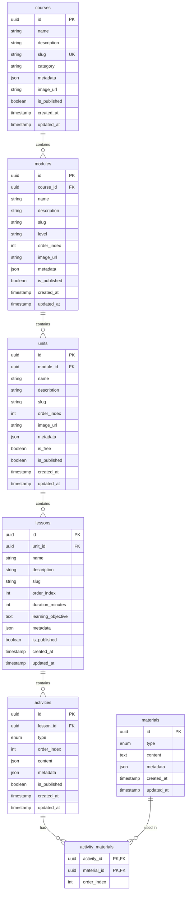

## Content Flow

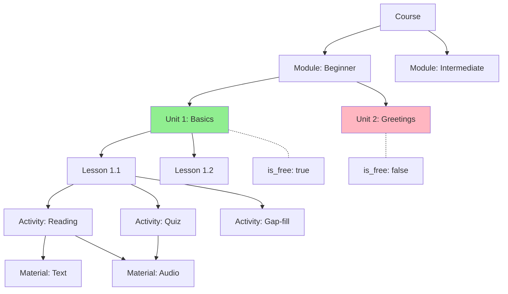

---

# Domain 2: Users & Authentication

User management with flexible signup modes.

## Tables

| Table | Purpose |
|-------|---------|
| `users` | All user accounts |
| `invites` | Invitation tokens for restricted signup |
| `app_settings` | System-wide configuration |

## Entity Relationship Diagram

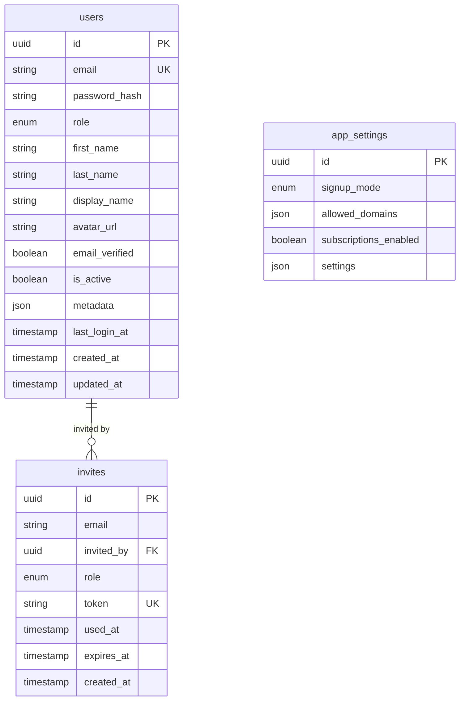

## Signup Modes

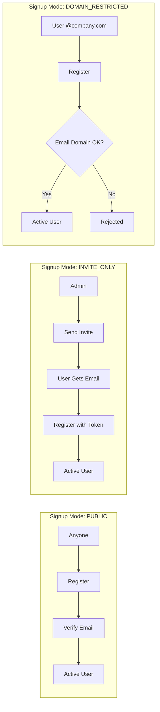

## Role Hierarchy

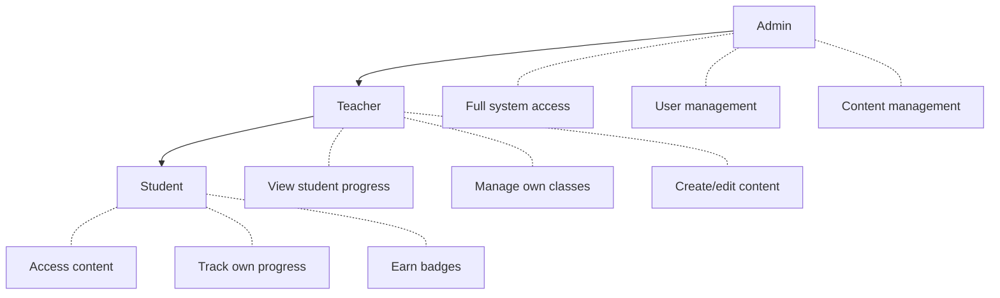

---

# Domain 3: Subscriptions & Payments

Optional monetization system - can be disabled for internal LMS deployments.

## Tables

| Table | Purpose |
|-------|---------|
| `subscription_plans` | Available plans (Monthly, Yearly, Lifetime) |
| `user_subscriptions` | User's active/past subscriptions |

## Entity Relationship Diagram

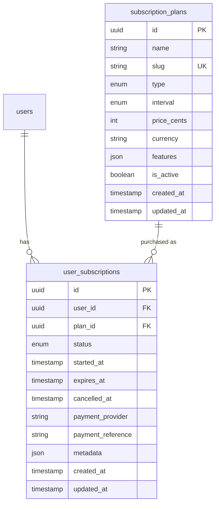

## Subscription Flow

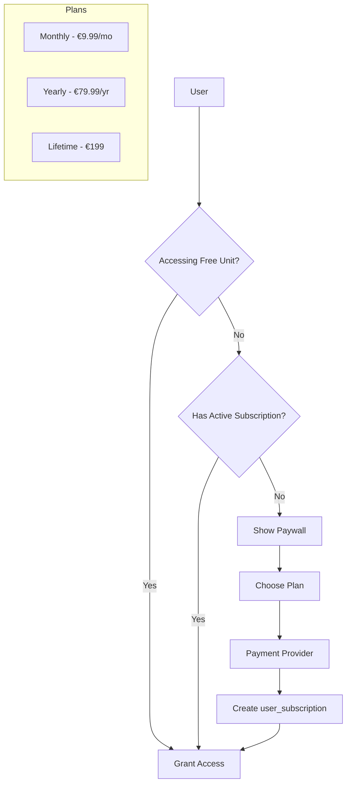

## Subscription States

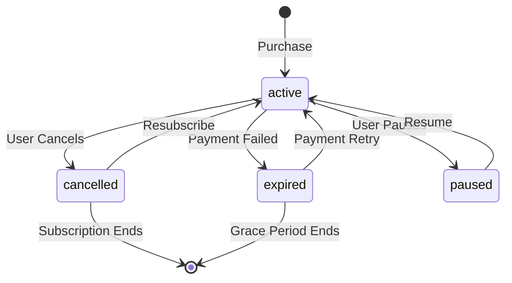

---

# Domain 4: Progress Tracking

Track user learning journey and performance.

## Tables

| Table | Purpose |
|-------|---------|
| `user_progress` | Completion status at any content level |
| `activity_attempts` | Individual activity submissions & scores |
| `user_stats` | Denormalized stats for fast dashboard |

## Entity Relationship Diagram

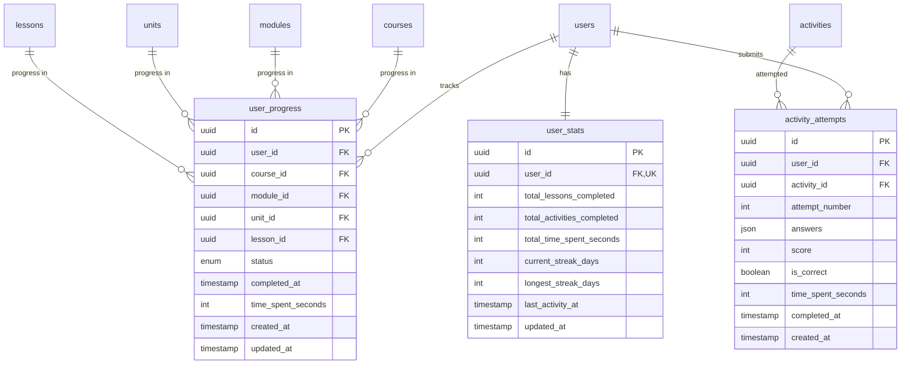

## Progress Flow

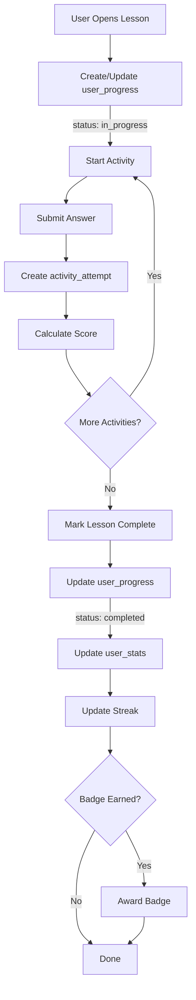

---

# Domain 5: Teacher Features

Class management and content authorship.

## Tables

| Table | Purpose |
|-------|---------|
| `classes` | Teacher-created groups of students |
| `class_students` | Student enrollment in classes |
| `content_authors` | Who can edit which content |
| `assignments` | Teacher-assigned content to classes |

## Entity Relationship Diagram

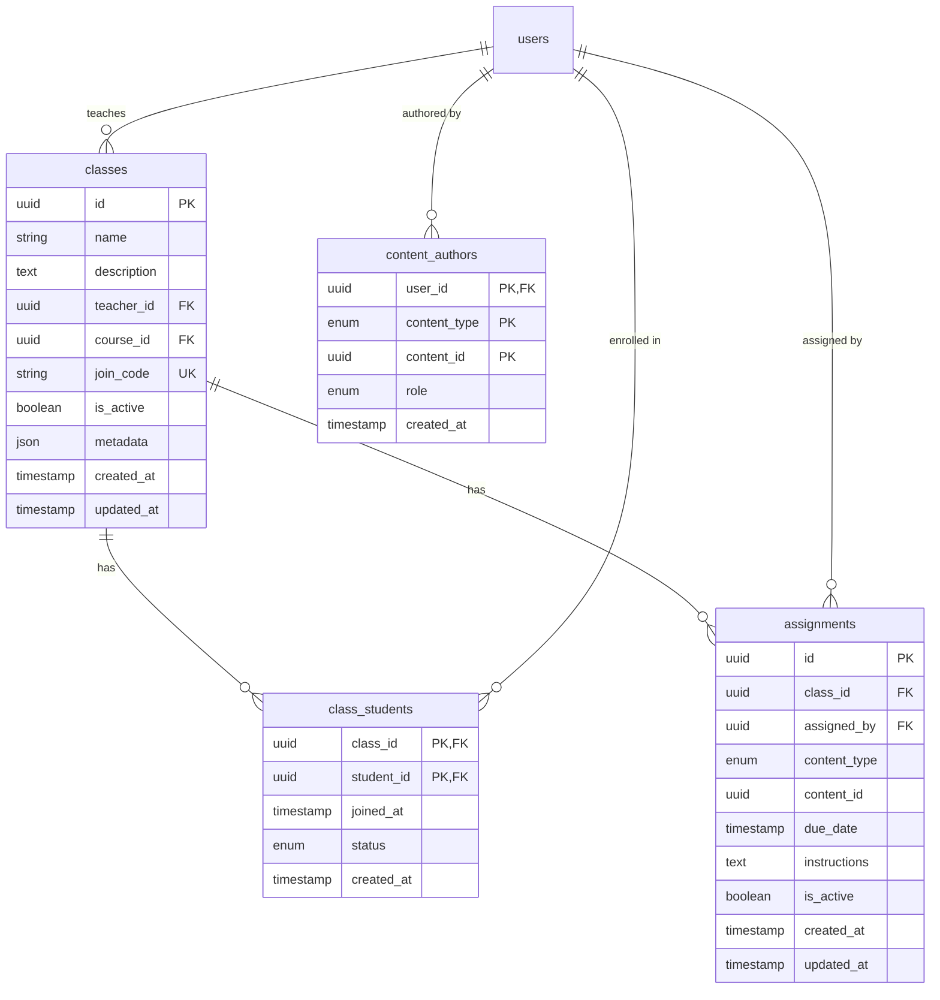

## Teacher Workflow

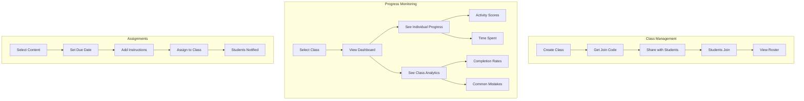

---

# Domain 6: Notifications

In-app and email notification system.

## Tables

| Table | Purpose |
|-------|---------|
| `notifications` | Individual notifications |
| `notification_preferences` | User notification settings |

## Entity Relationship Diagram

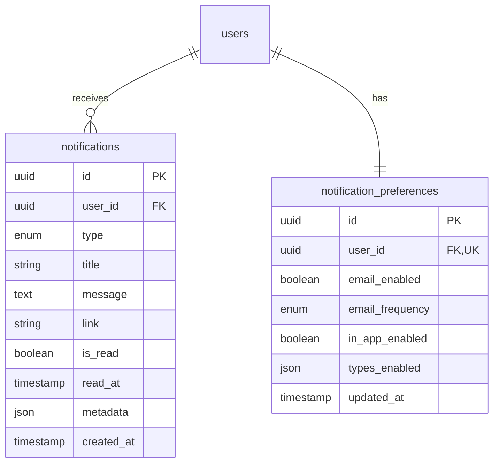

## Notification Types

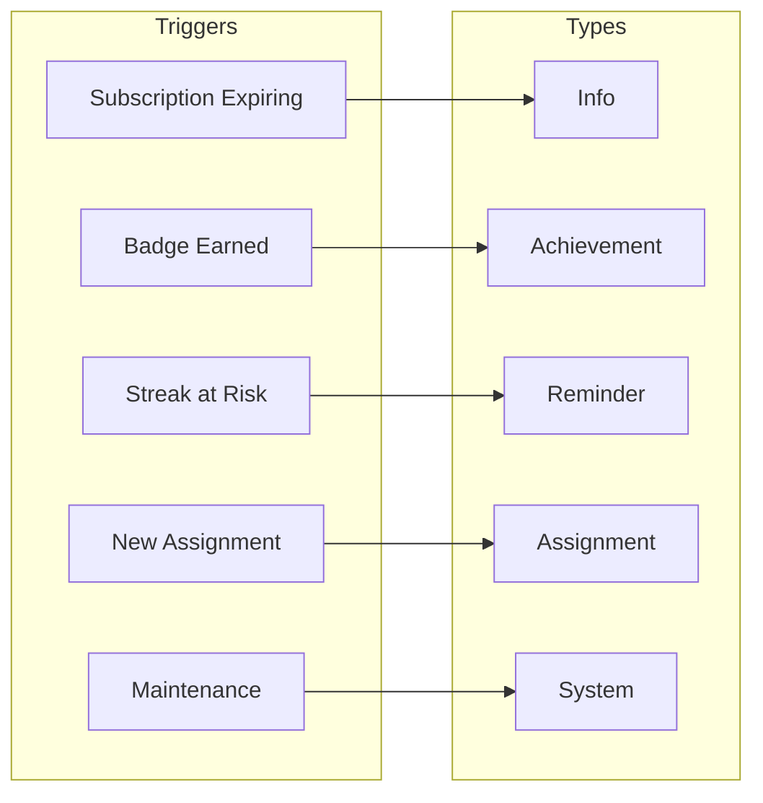

---

# Domain 7: Badges & Achievements

Gamification to increase engagement.

## Tables

| Table | Purpose |
|-------|---------|
| `badges` | Available badges with criteria |
| `user_badges` | Badges earned by users |

## Entity Relationship Diagram

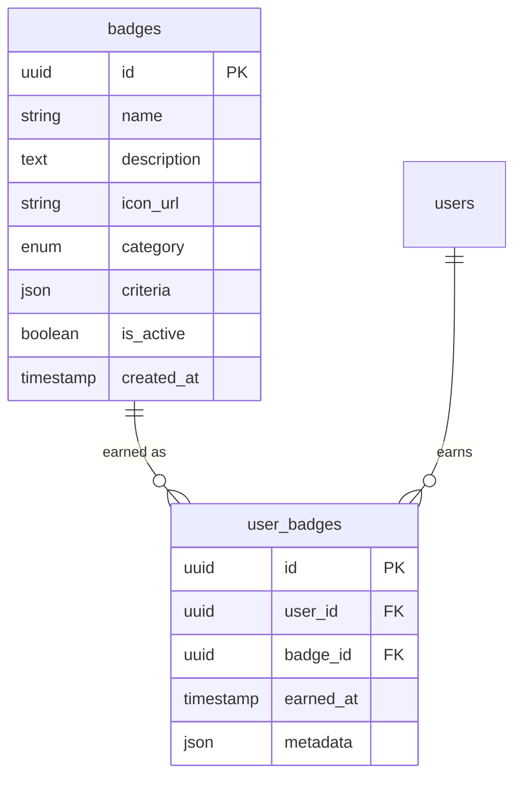

## Badge Categories

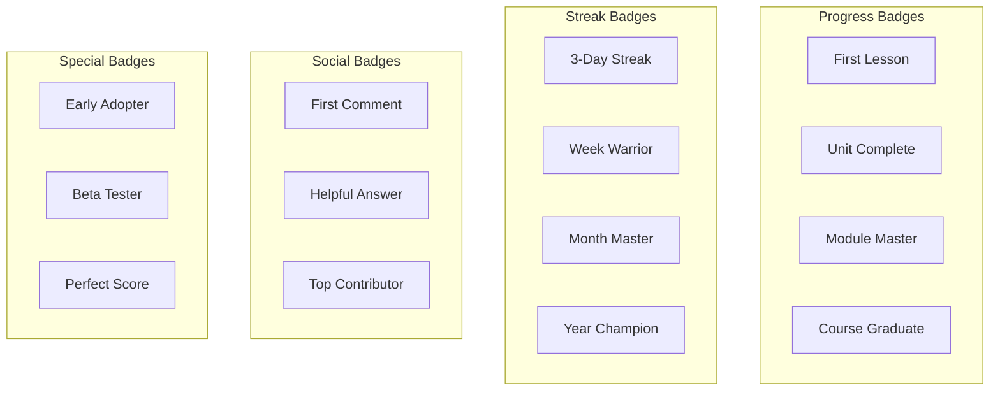

## Badge Criteria Examples

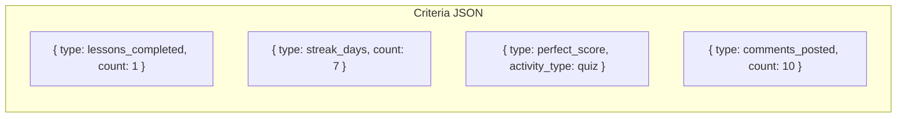

---

# Domain 8: Comments & Discussion

Social learning through discussion.

## Tables

| Table | Purpose |
|-------|---------|
| `comments` | User comments on content |
| `comment_reactions` | Likes/reactions on comments |

## Entity Relationship Diagram

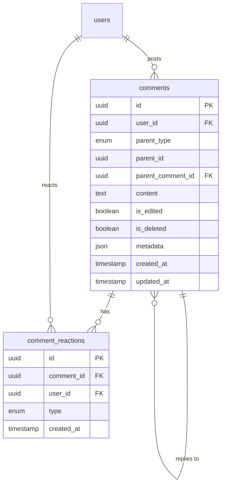

## Comment Threading

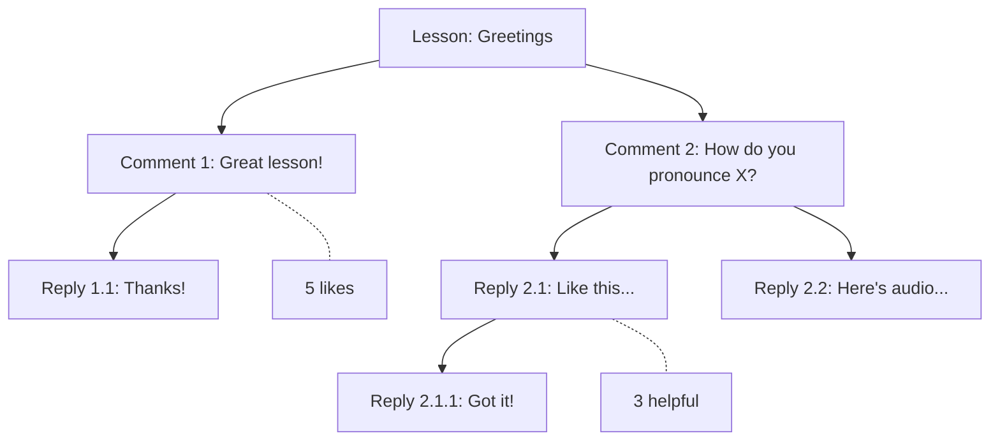

---

# Domain 9: Audit Log

Track all system changes for compliance and debugging.

## Tables

| Table | Purpose |
|-------|---------|
| `audit_logs` | Immutable log of all changes |

## Entity Relationship Diagram

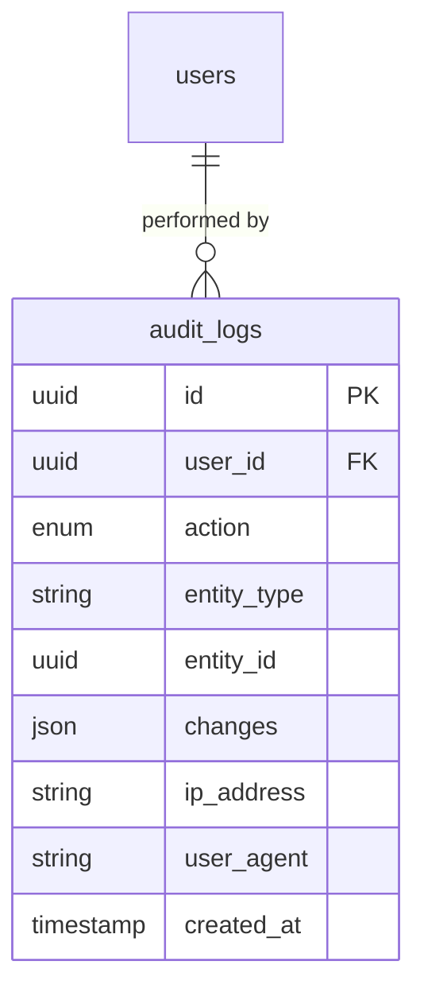

## Audit Actions

```mermaid
flowchart LR
    subgraph Actions
        CREATE[create]
        UPDATE[update]
        DELETE[delete]
        LOGIN[login]
        LOGOUT[logout]
    end

    subgraph "Example Log Entry"
        E1["user_id: abc-123"]
        E2["action: update"]
        E3["entity_type: lesson"]
        E4["entity_id: xyz-456"]
        E5["changes: {name: {old: X, new: Y}}"]
    end
```

---

# Complete System Overview

## All Tables by Domain

```mermaid
flowchart TD
    subgraph CONTENT["Content (7 tables)"]
        courses
        modules
        units
        lessons
        activities
        materials
        activity_materials
    end

    subgraph USERS["Users & Auth (3 tables)"]
        users
        invites
        app_settings
    end

    subgraph SUBS["Subscriptions (2 tables)"]
        subscription_plans
        user_subscriptions
    end

    subgraph PROGRESS["Progress (3 tables)"]
        user_progress
        activity_attempts
        user_stats
    end

    subgraph TEACHER["Teacher (4 tables)"]
        classes
        class_students
        content_authors
        assignments
    end

    subgraph NOTIF["Notifications (2 tables)"]
        notifications
        notification_preferences
    end

    subgraph BADGES["Badges (2 tables)"]
        badges
        user_badges
    end

    subgraph COMMENTS["Comments (2 tables)"]
        comments
        comment_reactions
    end

    subgraph AUDIT["Audit (1 table)"]
        audit_logs
    end
```

## Full Entity Relationship Diagram

```mermaid
erDiagram
    %% Content relationships
    courses ||--o{ modules : contains
    modules ||--o{ units : contains
    units ||--o{ lessons : contains
    lessons ||--o{ activities : contains
    activities ||--o{ activity_materials : has
    materials ||--o{ activity_materials : used_in

    %% User relationships
    users ||--o{ invites : invited_by
    users ||--o{ user_subscriptions : has
    subscription_plans ||--o{ user_subscriptions : purchased_as

    %% Progress relationships
    users ||--o{ user_progress : tracks
    users ||--o{ activity_attempts : submits
    users ||--|| user_stats : has

    %% Teacher relationships
    users ||--o{ classes : teaches
    classes ||--o{ class_students : has
    users ||--o{ class_students : enrolled_in
    classes ||--o{ assignments : has
    users ||--o{ content_authors : authored_by

    %% Social relationships
    users ||--o{ notifications : receives
    users ||--|| notification_preferences : has
    users ||--o{ user_badges : earns
    badges ||--o{ user_badges : earned_as
    users ||--o{ comments : posts
    comments ||--o{ comments : replies_to
    comments ||--o{ comment_reactions : has

    %% Audit
    users ||--o{ audit_logs : performed_by

    %% Simplified table definitions
    courses { uuid id PK }
    modules { uuid id PK }
    units { uuid id PK }
    lessons { uuid id PK }
    activities { uuid id PK }
    materials { uuid id PK }
    users { uuid id PK }
    subscription_plans { uuid id PK }
    classes { uuid id PK }
    badges { uuid id PK }
```

## Data Flow Overview

```mermaid
flowchart TD
    subgraph "User Journey"
        SIGNUP[Sign Up] --> AUTH[Authenticate]
        AUTH --> BROWSE[Browse Courses]
        BROWSE --> ACCESS{Has Access?}
        ACCESS -->|Free Unit| LEARN
        ACCESS -->|Subscribed| LEARN
        ACCESS -->|No| SUBSCRIBE[Subscribe]
        SUBSCRIBE --> LEARN[Start Learning]
        LEARN --> PROGRESS[Track Progress]
        PROGRESS --> COMPLETE[Complete Activities]
        COMPLETE --> BADGE[Earn Badges]
        COMPLETE --> DISCUSS[Join Discussion]
    end

    subgraph "Teacher Journey"
        T_LOGIN[Login as Teacher] --> T_CLASS[Create Class]
        T_CLASS --> T_CONTENT[Create Content]
        T_CONTENT --> T_ASSIGN[Create Assignments]
        T_ASSIGN --> T_MONITOR[Monitor Progress]
    end

    subgraph "Admin Journey"
        A_LOGIN[Login as Admin] --> A_USERS[Manage Users]
        A_USERS --> A_CONTENT[Manage All Content]
        A_CONTENT --> A_SUBS[Manage Subscriptions]
        A_SUBS --> A_AUDIT[View Audit Logs]
    end
```

---

# Deployment Configurations

## B2C SaaS (Public Platform)

```mermaid
flowchart LR
    subgraph Config
        C1[signup_mode: public]
        C2[subscriptions_enabled: true]
        C3[All features ON]
    end

    subgraph Users
        U1[Free Users]
        U2[Premium Subscribers]
        U3[Teachers]
        U4[Admins]
    end
```

## B2B Internal LMS

```mermaid
flowchart LR
    subgraph Config
        C1[signup_mode: domain_restricted]
        C2[allowed_domains: @company.com]
        C3[subscriptions_enabled: false]
        C4[All units: is_free = true]
    end

    subgraph Users
        U1[Employees only]
        U2[Trainers as Teachers]
        U3[HR as Admins]
    end
```

## B2B Invite-Only

```mermaid
flowchart LR
    subgraph Config
        C1[signup_mode: invite_only]
        C2[subscriptions_enabled: false]
        C3[Admin sends invites]
    end

    subgraph Users
        U1[Invited Users only]
        U2[No public access]
    end
```

---

# Technical Notes

## Why UUID for Primary Keys?

- Distributed system friendly
- Non-guessable (security)
- Can be generated client-side
- No sequential ID leakage

## Why JSON Metadata Fields?

- Domain flexibility (language learning vs safety training)
- No schema migrations for custom fields
- Easy to extend per deployment

## Indexes Recommendations

```sql
-- Content queries
CREATE INDEX idx_modules_course ON modules(course_id);
CREATE INDEX idx_units_module ON units(module_id);
CREATE INDEX idx_lessons_unit ON lessons(unit_id);
CREATE INDEX idx_activities_lesson ON activities(lesson_id);

-- Progress queries
CREATE INDEX idx_progress_user ON user_progress(user_id);
CREATE INDEX idx_progress_lesson ON user_progress(lesson_id);
CREATE INDEX idx_attempts_user ON activity_attempts(user_id);
CREATE INDEX idx_attempts_activity ON activity_attempts(activity_id);

-- Teacher queries
CREATE INDEX idx_classes_teacher ON classes(teacher_id);
CREATE INDEX idx_class_students_class ON class_students(class_id);
CREATE INDEX idx_class_students_student ON class_students(student_id);

-- Notifications
CREATE INDEX idx_notifications_user_unread ON notifications(user_id) WHERE is_read = false;

-- Audit (for compliance queries)
CREATE INDEX idx_audit_entity ON audit_logs(entity_type, entity_id);
CREATE INDEX idx_audit_user ON audit_logs(user_id);
CREATE INDEX idx_audit_date ON audit_logs(created_at);
```

---

# Summary

This data model provides:

1. **Flexibility** - Works for any educational domain
2. **Scalability** - Proper indexing, UUID keys, denormalized stats
3. **Configurability** - Features can be enabled/disabled
4. **Compliance** - Full audit logging
5. **Engagement** - Badges, streaks, social features
6. **Monetization** - Optional subscription system

Ready for deployment as:
- B2C SaaS platform
- B2B internal training system
- White-label solution
